# Excessorize — User Flow Graph & UX Rationale (v2 "Noir Atelier")

Every screen and animation in v2 traces back to this graph. If a state isn't on
it, it doesn't ship.

## 1. The flow graph

```mermaid
flowchart TD
    A[Launch] -->|first run| OB1[Onboarding · Welcome]
    A -->|returning| T[Today]

    OB1 --> OB2[Onboarding · Style DNA<br/>boldness, metals, archetypes]
    OB2 --> OB3[Onboarding · Seed the closet<br/>starter pack / camera / skip]
    OB3 --> T

    T -->|Style an outfit| S1[Stylist · Capture]
    T -->|latest look card| LD[Look Detail]
    T -->|stat cards| C[Closet] & L[Looks]

    C -->|+ Add piece| C1[Capture photo] --> C2[Analyzing] --> C3[Confirm & Tag] --> C
    C -->|tile tap| ID[Item Detail<br/>favorite · worn · edit · delete]
    C -->|search / sort / filter| C

    S1 -->|camera or library| S2[Analyzing<br/>color read] --> S3[Confirm the read<br/>colors · dress level · occasion · neckline]
    S3 -->|Style it| S4[Results<br/>tiered picks + why]
    S4 -->|swap| S4
    S4 -->|restyle| S4
    S4 -->|no candidates| S5[Empty + coaching] --> C1
    S4 -->|Save this look| L[Looks / Lookbook]

    L -->|search · sort · filter · favorite| L
    L -->|card tap| LD
    LD -->|share / delete / favorite| L

    P[Profile] -->|edit Style DNA| P
    P -->|Settings| SET[Settings<br/>export · import · reset · replay onboarding · about]
    T & C & S1 & L & P ---|tab bar| T

    style OB1 fill:#1c1812,stroke:#b9924a
    style S4 fill:#1c1812,stroke:#b9924a
```

## 2. UX audit that produced v2 (senior-dev pass on v1)

| Gap found in v1 | Fix in v2 | Principle |
|---|---|---|
| No onboarding — users landed on an empty Today with settings mixed into it | 3-step onboarding: promise → taste (Style DNA) → seed the closet. Skippable at every step; progress dots; no dead ends | Progressive disclosure; time-to-first-value < 60s |
| Style DNA (prefs) buried on the Today screen | Dedicated Profile tab; Today reserved for *content* | Screen = one job |
| No settings surface at all | Settings sheet: export/import (JSON), destructive reset with confirm, replay onboarding, version/about, privacy statement | User agency + data ownership (local-first means export matters) |
| Looks had no organization — a pile of cards | Search, 4 sort orders (newest / oldest / most pieces / A-Z), occasion + tier + favorites filters, favorite toggle | Recognition over recall; findability at n>10 |
| Closet sort was fixed (newest) | Sort menu: newest, name, dress level, most worn, never worn — "never worn" surfaces the app's core promise (use what you own) | Sort orders should express product values |
| Buttons appeared/disappeared with no continuity | Motion system: 240–420ms spring easing, staggered card entrances (30ms/child), sheet detent spring, crossfade tab transitions, marigold "saved" moment; all gated by `prefers-reduced-motion` | Motion explains hierarchy, never decorates |
| Iconography was minimal and inconsistent | Single 24px/1.7px-stroke icon set (10 icons), same optical grid, active tab = filled + gold | One visual voice |
| Toasts overlapped tab bar text | Toast repositioned + glass surface + auto-dismiss 2.2s | Feedback without obstruction |
| Low-confidence reads looked like errors | Amber "uncertain read" banners styled as guidance (never red); confirm screen is the hero, not a fallback | Errors are the system's fault, not the user's |

## 3. Motion spec

| Moment | Animation | Duration / easing |
|---|---|---|
| Screen enter | fade + 14px rise, children staggered 30ms | 420ms `cubic-bezier(.22,.9,.24,1)` |
| Sheet open | rise + settle (slight overshoot) | 380ms `cubic-bezier(.32,.72,.24,1.02)` |
| Primary button press | scale .97 + glow bloom | 140ms |
| Analyzing | breathing glass shimmer, 1.6s loop | linear |
| Results reveal | picks cascade in, tier tag fades late | 420ms + 60ms stagger |
| Save look | gold ring pulse on toast | 900ms, once |
| Tab change | crossfade 180ms | ease-out |
| `prefers-reduced-motion` | all transforms removed, opacity-only, ≤120ms | — |

## 4. Scenario matrix (each must pass before ship)

1. **Fresh install** → onboarding → skip everything → app still usable (empty
   states everywhere have a next action).
2. **Fresh install** → full onboarding → starter pack → style an outfit →
   save → look appears in Today + Looks.
3. **Power closet**: 12+ items, search "gold", sort by never-worn, filter
   category, edit a tag, favorite, mark worn.
4. **Lookbook at scale**: multiple saved looks, search, each sort order, each
   filter, favorite, detail, share sheet, delete with confirm.
5. **Conflicting constraints**: gym occasion + bold prefs → engine relaxes and
   the UI says what it loosened.
6. **Data ownership**: export JSON → reset app → import JSON → closet and
   looks fully restored.
7. **Persistence**: hard reload mid-session — nothing lost.
8. **Offline**: service worker serves the shell after first visit.
